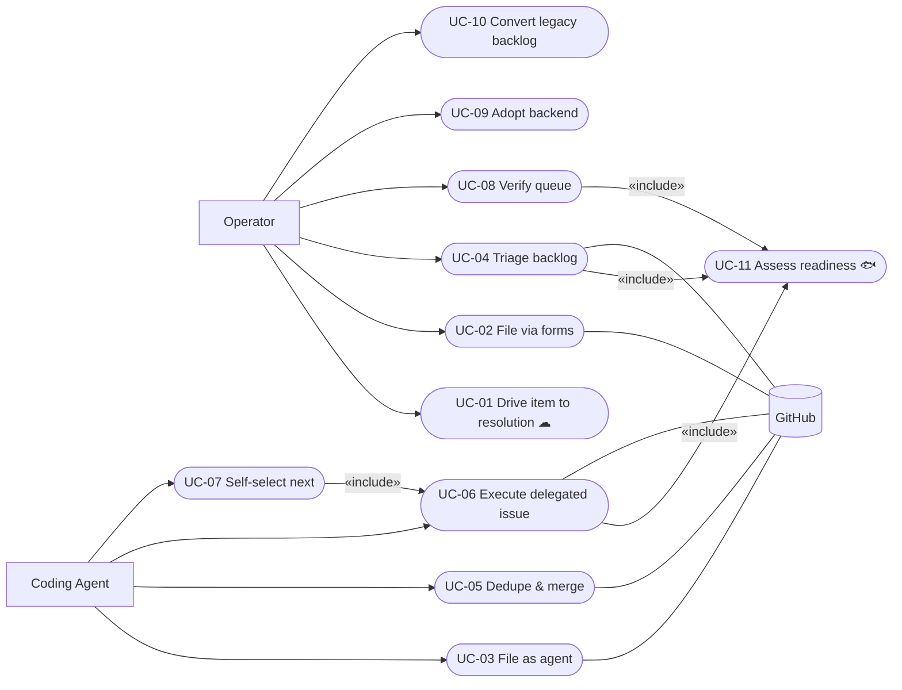

<!-- OKF reserved sub-folder index (docs/product-specs/use-cases/index.md): a directory
     listing, not an artefact concept document — frontmatter-free per
     the `metamodel` skill's `references/artefact-frontmatter.md` §Reserved files. The registry is the body below. -->

# Open-Items Agent-Execution System — Use Case Registry

The registry of use cases for the kit's backlog-execution system: the `github` open-items
backend (issues + labels + forms + labeler automation) operated through `util-open-items`
and `agent-issue-loop` (kit ADR-0008/ADR-0009). Each row points to one `uc-NN-{slug}.md`
file. A use case is the **actor↔system behavioural scenario** (all paths + guarantees) —
it grounds the skills' contracts; it is not a SKILL.md, an ADR, or a runbook.

Methodology (kit-only): `spec-use-case/references/methodology.md` — Cockburn textual use cases + UML diagrams + Jacobson Use-Case 2.0.

**Actors.** *Operator* — the human maintainer (files, triages, approves, reviews).
*Coding Agent* — an LLM-driven session (e.g. Claude Code) acting as a first-class actor;
its internals (model, prompts) are inside the box — use cases state what it does and
guarantees, never how it reasons. Supporting: *GitHub* (tracker/PR API), *Labeler
automation* (Actions workflow).

**Levels:** 🌊 user-goal (default) · ☁🪁 summary · 🐟🦪 subfunction. **Status:** ⬜ draft · 🔄 in progress · ✅ stable.

## Use Cases

| ID | Use case (goal) | Level | Scope | Primary actor | Realises (FBS) | Status |
|---|---|---|---|---|---|---|
| UC-01 | Drive an item from identified to resolved | ☁ | system | Operator | _TBD_ | ⬜ |
| UC-02 | File an issue via the tracker forms | 🌊 | system | Operator | _TBD_ | ⬜ |
| UC-03 | File an issue as an agent | 🌊 | system | Coding Agent | _TBD_ | ⬜ |
| UC-04 | Triage the backlog | 🌊 | system | Operator | _TBD_ | ⬜ |
| UC-05 | Deduplicate and merge issues | 🌊 | system | Coding Agent | _TBD_ | ⬜ |
| UC-06 | Execute a delegated issue | 🌊 | system | Coding Agent | _TBD_ | ⬜ |
| UC-07 | Self-select the next work item | 🌊 | system | Coding Agent | _TBD_ | ⬜ |
| UC-08 | Verify the queue is trustworthy | 🌊 | system | Operator | _TBD_ | ⬜ |
| UC-09 | Adopt the backend on a new repo | 🌊 | system | Operator | _TBD_ | ⬜ |
| UC-10 | Convert a legacy backlog | 🌊 | system | Operator | _TBD_ | ⬜ |
| UC-11 | Assess an issue's readiness | 🐟 | system | (reused step) | _TBD_ | ⬜ |

## Actor / use-case overview

