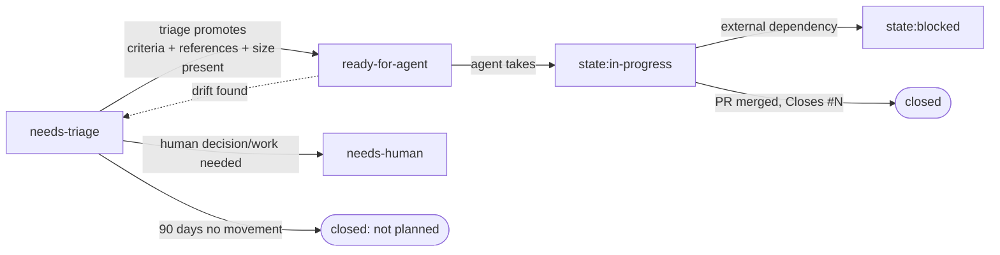

# Open Items — Central Control Plane

This folder documents where unresolved work lives for this repo and how to operate it.
Since 2026-06-04 this repo runs the **`github` backend** ([`backend.yml`](./backend.yml)):
**the issue tracker is the ledger** — every bug, feature, task, docs gap, and tech-debt
item is a GitHub Issue, classified and driven through labels (kit ADR-0008/ADR-0009).
There is no live markdown ledger here; the files in this folder are history and
configuration.

- **Live backlog:** <https://github.com/VictorHueni/homemade-claude-kit/issues>
- **Delegation queue (what an agent may take):**
  [`is:open label:ready-for-agent`](https://github.com/VictorHueni/homemade-claude-kit/issues?q=is%3Aopen+label%3Aready-for-agent)
- **Filing:** the per-type issue forms (`1-bug` … `5-tech-debt` in the chooser), or
  `util-open-items` `sync` for skill/agent filings — always after a duplicate +
  dependency search.

---

## Label vocabulary (quick reference)

17 labels, five mutually-exclusive axes — one label per axis, at most 5 per issue.
Canonical names/colors/descriptions: ADR-0009 §5; bootstrap:
`util-open-items/scripts/bootstrap_labels.sh`.

| Axis | Labels | Meaning |
| :--- | :--- | :--- |
| `type:` | `bug` · `feature` · `task` · `docs` · `tech-debt` | What kind of work. Decision work is a `task` whose deliverable is the ADR/decision record. Governance mapping: doc-gap→docs, decision-gap→task, execution-item→task, tech-debt→tech-debt. |
| `priority:` | `p0` (critical) · `p1` (high) · `p2` (medium) · `p3` (low) | The filer's claim, confirmed at triage. |
| `size:` | `S` · `M` · `L` | One-PR effort bound. `L` = consider splitting before delegation. |
| readiness | `needs-triage` → `ready-for-agent` \| `needs-human` | Delegation trust state (see below). |
| `state:` | `in-progress` · `blocked` | Work execution state; replaces the readiness label when an agent takes the issue. |

## The readiness state machine

`ready-for-agent` is a **guarantee**: an issue may carry it only with non-empty
`### Acceptance criteria` (ending in a runnable check) + `### References` (code
pointers) + a `size:` label (ADR-0008 §3). Promotion is **triage-owned** — filers and
filing agents always start at `needs-triage`.

## Operating it

| I want to… | Do |
| :--- | :--- |
| File an item | Issue form (humans) or `util-open-items sync` (skills/agents) — duplicate + dependency search first |
| Triage the queue | `util-open-items triage` — proposes promotions (drafting missing briefs), `needs-human` routing, 90-day staleness drops; you approve a disposition table |
| Check one issue's readiness | `agent-issue-loop validate #N` (drafts the missing brief on a near-miss) |
| Keep the queue trustworthy | `agent-issue-loop validate --queue` (cited demotion proposals) |
| Merge duplicates | `agent-issue-loop dedupe` (operator-approved; context preserved, duplicate closed `not planned`) |
| Have an agent work an issue | `agent-issue-loop take #N`, or `next` (highest priority, smallest size) |
| Close / drop | Merge the PR (`Closes #N`) / `util-open-items drop` with rationale — closure always carries evidence |
| Health snapshot | `util-open-items report` (label-query based) |

**Optional triggered automation:** the `@claude` GitHub Action
(anthropics/claude-code-action, installed via `/install-github-app`) can react to issue
mentions/assignment and open PRs. Documented as an option, deliberately not installed by
default — per-repo choice.

## Adopting on another repo

Follow the checklist in `util-open-items/SKILL.md` §Backends (order matters):
**1.** `bootstrap_labels.sh --repo OWNER/NAME --apply` → **2.** install the five forms +
`config.yml` + labeler workflow from `util-open-items/templates/` → **3.** ensure
`CLAUDE.md` has a verification-commands section (the measured driver of agent success) →
**4.** write `backend.yml`.

**Converting a messy markdown TODO list** (the common starting state): do NOT bulk-import.
Run an agent-assisted convert-and-triage session — for each list item the agent proposes
either a normalized issue draft (type, priority, size, code pointers) or *"don't migrate:
stale/vague/superseded"*; you approve the batch; survivors are filed via `sync`; the
markdown file is frozen as a dated archive with a pointer to the issues. Migration is the
natural bankruptcy moment — expect (and want) only a fraction of an old list to survive.
Structured `markdown`-backend ledgers instead use the Mode 7 migration script
(`migrate_markdown_to_github.py`, dry-run first).

---

## Files in this folder

| File | Purpose |
| :--- | :--- |
| `README.md` | This file. |
| `backend.yml` | Backend declaration (`github` + repo). |
| `open-items.md` | Retired markdown ledger — migration banner + pointers (history). |
| `migration-map.md` | The `OI-NNNN → #N` identity map from the 2026-06 migration. |
| `archive/` | Frozen pre-migration snapshots. Never the live state. |

## History & contracts

- Abstract model (taxonomy, lifecycle, provenance, evidence-gated closure):
  the `metamodel` skill's `references/open-items-governance.md`.
- Serialization (labels, forms, queries): `util-open-items/references/github-backend.md`.
- Decisions: [ADR-0002](../../architecture/decisions/adr-0002-open-items-pluggable-backend-github-issues.md)
  (pluggable backend) · [ADR-0003](../../architecture/decisions/adr-0003-github-backend-stays-opt-in.md)
  (github stays opt-in) · [ADR-0005](../../architecture/decisions/adr-0005-open-items-ledger-sole-authoring-surface.md)
  (direct filing) · [ADR-0008](../../architecture/decisions/adr-0008-open-items-agent-execution-labels.md)
  (label serialization + readiness contract) · [ADR-0009](../../architecture/decisions/adr-0009-standard-issue-vocabulary-github-backend.md)
  (standard vocabulary, marker retired).
- Research: [0001 setup analysis](../../architecture/research/0001-open-items-agent-execution-setup.md) ·
  [0002 issue-creation practices](../../architecture/research/0002-github-issue-creation-best-practices.md) ·
  [0003 template conformance](../../architecture/research/0003-issue-template-conformance-review.md).
