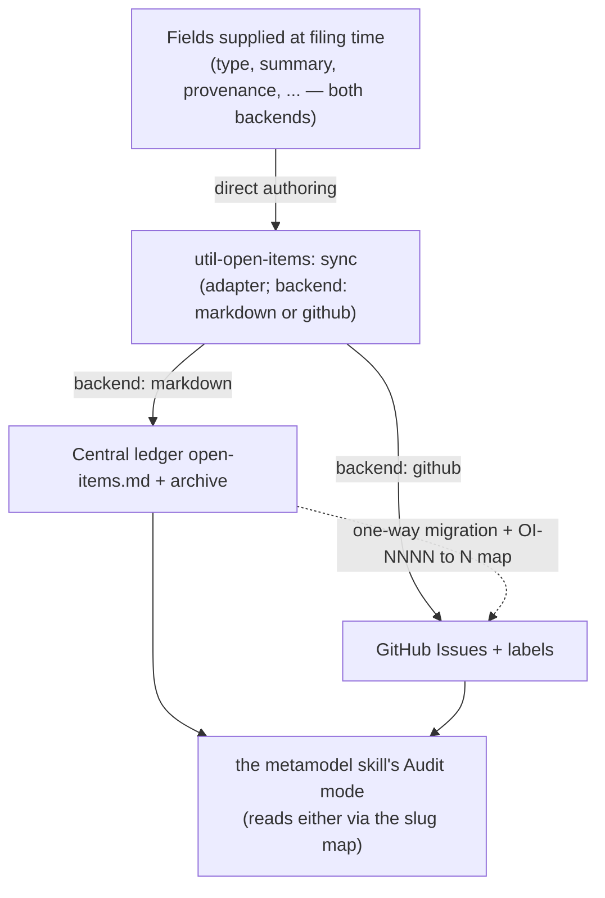
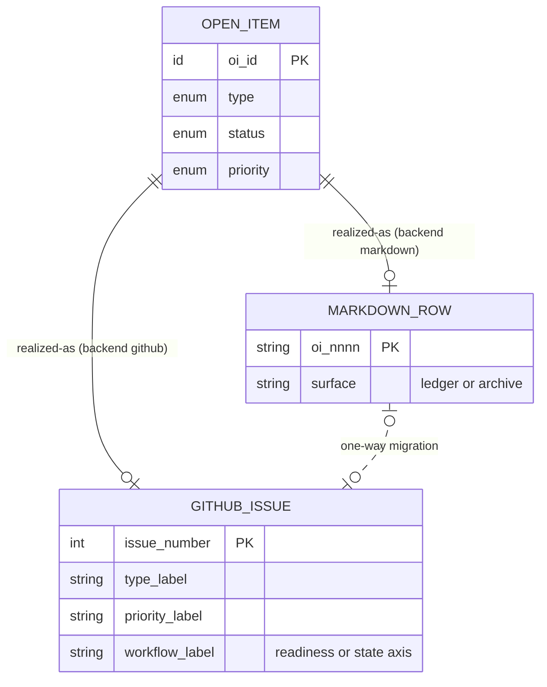

# Open Items — GitHub Backend Reference

Operational reference for the `github` backend of `util-open-items`. This file travels with
the skill (symlinked into `~/.claude/skills/`), so it is available to every project that
selects the backend **without ever being copied into a project's `docs/`**.

## Authority boundary

- **the `metamodel` skill's `references/open-items-governance.md` owns the abstract model** — the §4 schema, §2 taxonomy,
  §3 lifecycle, and the §5.3 backend abstraction + invariants. It is backend-independent and
  user-global.
- **This reference owns the `github` serialization** — how the abstract model maps onto
  GitHub primitives, the status decomposition, and the one-way migration mechanics.
- **No project `docs/` file owns any of it.** A project's `docs/project-control/open-items/`
  holds the live `markdown` ledger (if that backend is used) and nothing about the model
  itself.

Where this file and the rule conflict on taxonomy / lifecycle / schema, the rule wins; this
file is authoritative only for the `github` mapping.

## Scope

Per `adr-0002`, the `github` backend is an **opt-in** backend selected per project via
`backend.yml`; `markdown` stays the universal default (`adr-0003` declined to generalise).
`adr-0008` amended this serialization: `priority` and the `in-progress`/`blocked` status
decomposition live in **labels** (the originally-mapped Project v2 fields were never wired
and are retired), and the backend gains an optional **execution layer** (`size`,
`readiness`, agent-ready content fields) so coding agents can query and take issues.
`adr-0009` amended the vocabulary: the type axis is the **standard 6-value set**
(bug/feature/task/docs/decision/tech-debt, §2a), the `open-item` marker is retired (the
tracker is the ledger), and intake is one Issue Form per type.

---

## 1. Canonical field slugs (the binding contract)

The rule's §4 columns each have a **stable slug** (lower-snake). The slug — not the column
header, not a UI label — is what every backend binds to. The audit reads any backend through
this one slug set.

```text
oi_id · type · summary · source_artefact · source_anchor ·
source_heading · resolution_path · priority · status · owner ·
review_date · tracker_ref
```

**Optional execution-layer slugs** (`adr-0008`, additive per governance §4 — sanctioned
informational additions after the canonical set; a backend that omits them is still
conformant):

```text
size · readiness · references · acceptance_criteria · out_of_scope
```

| Slug | §4 column | Domain |
| :--- | :--- | :--- |
| `oi_id` | OI-ID | identity (realized per backend — §3) |
| `type` | Type | governance §2 values (`doc-gap` · `decision-gap` · `execution-item` · `tech-debt`); github serializes via the 6-value standard vocabulary (§2a, `adr-0009`) — `bug`/`feature` are tracker-native extras |
| `summary` | Summary | one self-contained sentence |
| `source_artefact` | Source artefact | repo path \| scope marker \| empty |
| `source_anchor` | Source anchor | `#…` \| empty |
| `source_heading` | Source heading | string \| `_central-only_` |
| `resolution_path` | Resolution path | string |
| `priority` | Priority | `low` · `medium` · `high` · `critical` |
| `status` | Status | `open` · `in-progress` · `blocked` · `closed` · `dropped` |
| `owner` | Owner | string \| `_TBD_` |
| `review_date` | Due / Review date | ISO-8601 |
| `tracker_ref` | Tracker ref | URL \| `_TBD_` (non-`_TBD_` required for terminal) |

| Optional slug | Domain | Owner |
| :--- | :--- | :--- |
| `size` | `S` · `M` · `L` (one-PR effort bound) | filer |
| `readiness` | `needs-triage` · `ready-for-agent` · `needs-human` | **triage only** (creation default: `needs-triage`) |
| `references` | code pointers: files, symbols, prior PRs, patterns to imitate | filer |
| `acceptance_criteria` | observable pass/fail checklist ending in a runnable check | filer |
| `out_of_scope` | what must not be touched | filer (optional) |

**Field partition** — drives the mapping below:

- **Authoring-time** (`type`, `summary`, `source_*`, `resolution_path`, `priority`, `size`,
  `references`, `acceptance_criteria`, `out_of_scope`) → title, labels, and the **Issue
  Form**.
- **Lifecycle** (`status`, `owner`, `review_date`, `tracker_ref`, `oi_id`) → **native GitHub
  primitives**. Never hand-typed into a body — which is why github closure is structurally
  enforced.
- **Triage-owned** (`readiness` beyond its `needs-triage` default) → labels applied only by
  a triage pass or operator, never by the filer (`adr-0008` §3).

---

## 2. GitHub serialization

Every field is supplied directly at filing time regardless of backend (rule §1); only where
it lands changes. One `OpenItem` ⇒ one **Issue**, projected into one **Project**.

| Canonical slug | GitHub home | Mechanism |
| :--- | :--- | :--- |
| `oi_id` | Issue **number** `#N` | native; `OI-NNNN` retired in this backend |
| `type` | **Label** `type:bug\|feature\|task\|docs\|decision\|tech-debt` — form-static per template | 6-value standard vocabulary (`adr-0009`); governance §2 maps in via §2a |
| `summary` | Issue **title** | |
| `source_artefact` | Issue Form field `source_artefact` | `input` |
| `source_anchor` | Issue Form field `source_anchor` | `input` |
| `source_heading` | Issue Form field `source_heading` | `input` (or `_central-only_`) |
| `resolution_path` | Issue Form field `resolution_path` | `textarea` |
| `priority` | **Label** `priority:p0..p3` | `critical`↔`p0` · `high`↔`p1` · `medium`↔`p2` · `low`↔`p3` (`adr-0008`; Project field retired unwired) |
| `status` | Issue state **+** `state:` label **+** close reason | composite (§3c) |
| `owner` | **Assignee** | native |
| `review_date` | **Milestone** due date | Project date field retired per `adr-0008` |
| `tracker_ref` | **Closing reference** (`Closes #N`, linked PR) | native; unfakeable |
| `size` | **Label** `size:S\|M\|L` | optional (execution layer) |
| `readiness` | **Label** `needs-triage` \| `ready-for-agent` \| `needs-human` | optional (execution layer); triage-owned |
| `references` | Issue Form field `references` | `textarea` |
| `acceptance_criteria` | Issue Form field `acceptance_criteria` | `textarea` |
| `out_of_scope` | Issue Form field `out_of_scope` | `textarea`, optional |
| read-out | Filtered issue lists (labels) | Projects v2 board deferred to [#73](https://github.com/VictorHueni/homemade-claude-kit/issues/73) |
| archive | **Closed issues** (searchable indefinitely) | `archive` mode is a no-op here |

The **Issue Forms** (one per type — `bug` / `feature` / `task` / `docs` / `decision` /
`tech-debt`, templates `form-<type>.yml` in this skill) carry only the authoring-time
partition; each form statically applies its `type:` label + `needs-triage`; the lifecycle
partition is native GitHub; readiness is triage-owned.

### 2a. Type vocabulary and governance mapping (`adr-0009`)

The type axis uses the **standard 6-value vocabulary**; there is no marker label — under
this backend the repo's issue tracker *is* the ledger. The governance §2 taxonomy maps in:

| Governance §2 | Serialized as | | Tracker-native (no §2 counterpart) |
| :--- | :--- | :--- | :--- |
| `doc-gap` | `type:docs` | | `type:bug` |
| `decision-gap` | `type:decision` | | `type:feature` |
| `execution-item` | `type:task` | | |
| `tech-debt` | `type:tech-debt` | | |

Tracker-native issues (`bug`, `feature`) are ordinary dev work: structural checks (axis
exclusivity, readiness contract) apply to them; provenance checks apply only to issues
carrying provenance sections. The audit reads `type` back through this mapping.

### 2b. Execution layer (`adr-0008`, vocabulary as amended by `adr-0009`)

The canonical label vocabulary — 18 labels across five mutually-exclusive axes (`type:`,
`priority:`, `size:`, readiness, `state:`), exact names/colors/descriptions in `adr-0009`
§5 — is bootstrapped idempotently by `scripts/bootstrap_labels.sh` **before** any surface
that names a label ships (forms silently skip nonexistent labels).

Rules:

- **One label per axis.** At most 4–5 labels apply to one issue (marker + type + priority
  + size + one workflow label). Violations are audit findings.
- **Readiness contract.** An issue MAY carry `ready-for-agent` only if
  `acceptance_criteria` and `references` are non-empty and `size` is set. `needs-triage`
  is the creation default (form- and `sync`-applied); promotion/routing to
  `ready-for-agent`/`needs-human` happens only via a triage pass or operator approval.
  Filing agents never self-promote.
- **Label handover.** When work starts (`take`), `state:in-progress` replaces the
  readiness label; `state:blocked` per §3 lifecycle. The closing flow removes
  readiness/`state:` labels at terminal state; leftovers on closed issues are audit
  hygiene findings, not drift.
- **Queries.** The delegation queue is `is:open label:ready-for-agent`, picked by
  highest `priority:` (tie-break: smallest `size:`). No body parsing anywhere in the
  execution path.
- **Validation home.** Form `validations.required` gates only the web UI; `gh`/API filing
  bypasses forms, so `util-open-items` refusal rules are the authoritative gate
  (`adr-0008` §6).

---

## 3. Interoperability

### 3a. Field-slug map (Invariant I1)

Issue-Form field `id:` ≡ canonical slug (e.g. `id: source_heading`, not `id: heading`). This
is what lets the `metamodel` skill's Audit mode parse an issue body exactly as it parses a ledger row.

### 3b. Identity translation (Invariant I2)

| | `markdown` | `github` |
| :--- | :--- | :--- |
| identity | `OI-NNNN` (minted) | `#N` (issue number) |
| ID space | independent | independent |

Migration is **`markdown → github` only**, performed once at adoption, and **must** emit a
persisted `OI-NNNN → #N` map so existing back-references (artefact body text; any
`tracker_ref` pointing at an old `OI-ID`) can be rewritten. No bidirectional or live sync —
two writers over two ID spaces is the dual-source-of-truth anti-pattern. A project runs
exactly one backend.

The migration is operated by **Mode 7 (`migrate`)** in `SKILL.md`, driven by
`scripts/migrate_markdown_to_github.py` (dry-run by default). It writes the map to
`docs/project-control/open-items/migration-map.md` and rewrites `OI-NNNN` back-references to
`#N` across the docs tree.

### 3c. Status decomposition (Invariant I3)

| Canonical `status` | Issue state | `state:` label | Close reason |
| :--- | :--- | :--- | :--- |
| `open` | open | (none) | — |
| `in-progress` | open | `state:in-progress` | — |
| `blocked` | open | `state:blocked` | — |
| `closed` | closed | (removed at close) | completed |
| `dropped` | closed | (removed at close) | **not planned** |

`closed` / `dropped` require a non-`_TBD_` `tracker_ref` — automatic on `github` (you close
*via* a reference); validated by `util-open-items` on `markdown`.

---

## 4. Invariants

- **I1** — Issue-Form `id:` keys ≡ canonical slugs ≡ markdown column meanings. One field map,
  both backends. The optional execution slugs (`size`, `readiness`, `references`,
  `acceptance_criteria`, `out_of_scope`) join the slug map as optional entries — same
  contract, absence is conformant.
- **I2** — Migration is one-way (`markdown → github`), once, with a persisted ID map; never
  concurrent. One backend per project.
- **I3** — Terminal status requires evidence (`tracker_ref`); native on `github`, validated
  on `markdown`.
- **I4** — Filing is direct in both backends (rule §1): switching backends never introduces
  or removes an authoring step, only where `sync` writes to.
- **I5** — Provenance is the same composite in both backends; central-only items are
  `_central-only_` heading + empty anchor in both.

---

## 5. Diagrams





Each `OpenItem` is realized in exactly one backend per project; the two `realized-as`
relationships are mutually exclusive, enforced by the `backend:` setting, not the schema.

---

## See also

- the `metamodel` skill's `references/open-items-governance.md` §4–§5 — the abstract model + backend abstraction (owner).
- `util-open-items/references/template.md` — the `markdown`-backend ledger skeleton.
- `adr-0002` (in a consuming repo's `docs/architecture/decisions/`, e.g. the kit) — the
  decision this mapping implements; `adr-0003` — github stays opt-in; `adr-0008` — the
  label-based serialization amendment + execution layer; `adr-0009` — the standard
  6-value type vocabulary, marker retirement, and per-type forms this file conforms to.
