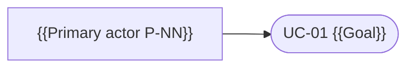

<!-- OKF reserved sub-folder index (docs/product-specs/use-cases/index.md): a directory
     listing, not an artefact concept document — frontmatter-free per
     the `metamodel` skill's `references/artefact-frontmatter.md` §Reserved files. The registry is the body below. -->

# {{product_or_scope}} — Use Case Registry

The registry of use cases for {{product_or_scope}}. Each row points to one `uc-NN-{slug}.md` file. A use case is the **actor↔system behavioural scenario** (all paths + guarantees) — it realises FBS functionalities and grounds PRDs; it is not a user story, an FBS row, or a UI spec.

Methodology (kit-only): `spec-use-case/references/methodology.md` — Cockburn textual use cases + UML diagrams + Jacobson Use-Case 2.0.

**Levels:** 🌊 user-goal (default) · ☁🪁 summary · 🐟🦪 subfunction. **Status:** ⬜ draft · 🔄 in progress · ✅ stable.

<!-- LAYOUT: use ONE of the two forms below.
     • No capability map → keep the flat "## Use Cases" table; files live at use-cases/ root.
     • Capability map exists → delete the flat table and use the "## Use Cases by capability"
       form: one group per L1 capability (folder = its canonical `slug`), plus Unassigned.
       See the spec-use-case skill's §Organizing use cases by capability. -->

## Use Cases

| ID | Use case (goal) | Level | Scope | Primary actor | Realises (FBS) | Status |
|---|---|---|---|---|---|---|
| UC-01 | {{Goal verb phrase}} | 🌊 | system | {{P-NN}} | {{C-N.M.FXX}} | ⬜ |

<!-- ── Capability-grouped form (use when docs/business/03a-capability-map.md exists) ──

## Use Cases by capability

### C-N.M · {{Capability name}} (`{{capability-slug}}`)

Files: [`{{capability-slug}}/`]({{capability-slug}}/)

| ID | Use case (goal) | Level | Scope | Primary actor | Realises (FBS) | Status |
|---|---|---|---|---|---|---|
| UC-01 | {{Goal verb phrase}} | 🌊 | system | {{P-NN}} | {{C-N.M.FXX}} | ⬜ |

### Unassigned (no capability link yet)

Files at `use-cases/` root; re-file under a capability once `Realises:` is set.

| ID | Use case (goal) | Level | Scope | Primary actor | Realises (FBS) | Status |
|---|---|---|---|---|---|---|
| UC-NN | {{Goal verb phrase}} | 🌊 | system | {{P-NN}} | _TBD_ | ⬜ |
-->

## Actor / use-case overview (optional)

_Optional UML-style overview — an at-a-glance map of actors → goals. Keep it small (≤ ~20 use cases); the text files are the contract, this is only a map. Mermaid example:_

